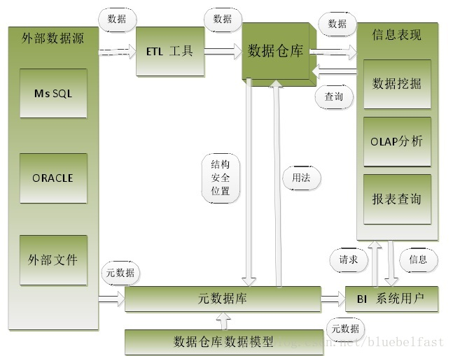
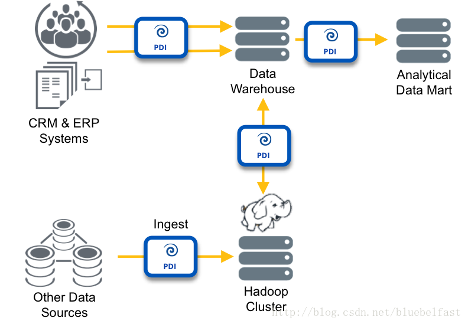
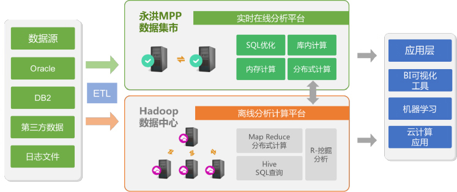

###1、大数据与BI
####1.1、传统BI
>BI(BusinessIntelligence)即商务智能： 它是一套完整的解决方案，用来将企业中现有的数据进行有效的整合，快速准确的提供报表并提出决策依据，帮助企业做出明智的业务经营决策。
商业智能BI在数据架构中处于前端分析的位置，其核心作用是对获取数据的多维度分析、数据的切片、数据的上钻和下钻、cube等。通过ETL数据抽取、转化形成一个完整的数据仓库、然后对数据仓库的数据进行抽取，而后是商业智能的前端分析和展示。

>>ETL(Extraction Transformation Loading)数据提取、转换和加载，是将业务系统的数据经过抽取、清洗转换之后加载到数据仓库的过程，目的是将企业中的分散、零乱、标准不统一的数据整合到一起，为企业的决策提供分析依据。

传统的商业智能系统一般采用以下的系统架构进行构建：

系统主要由三层构成：分别是1）数据抽取层即传统的ETL；2）数据分析层，即传统的数据仓库；3）数据展示层，即传统的OLAP。

####1.2、大数据
>大数据的本质就是利用计算机集群来处理大批量的数据，大数据的技术关注点在于如何将数据分发给不同的计算机进行存储和处理。

####1.3、大数据时代的新BI
将大数据分析结合进传统的BI系统中，可以在分析能力和分析类型上对传统的BI系统进行扩展。具体描述如下：
1、分析能力的增强：通过将Hadoop等分布式大数据分析平台结合进BI系统可以增强数据的分布式并行处理能力，从而从底层增加计算能力，为传统的数据挖掘分析带来新鲜血液。
2、分析能力的扩展：结合大数据分析，可以将以往无法分析的非结构化数据或半结构化数据分析结合进BI系统，极大的扩展Bi系统的分析能力。
3、对专家系统的机器学习补充：传统的BI系统数据仓库和数据集市是由专家知识构建的，这样的专家知识可能随着业务的变迁或扩展不再完全准确，因此BI系统如果想真正实现智能化的分析过程，不仅需要专家知识，更需要从与实际业务实时相关的数据中分析出数据的关联性和知识性。因而对于智能化的数据分析与挖掘能力的需求与日俱增。大数据分析能力正好弥补了传统BI系统无法从数据中机器学习和分析的能力的不足。

针对BI技术的大数据扩展趋势，目前多家公司都制定了自己的融合软件架构方案。其中Pentaho作为一家开源的BI开发公司也实现了自己的BI融合Hadoop架构。在著名的开源ETL项目Kettel5.0版本中已经实现了大数据补丁，提供与大数据分析系统的交互。其架构如下。

清晰可见的hadoop小象。通过其PDI（pentaho date integration）层主要是ETL，实现与传统的关系数据库和hadoop间进行交互。同时其也提出了结合hadoop的大数据分析虚拟层。

###2、可视化大数据BI架构

从数据源到最终展现分成如下几层:

- ETL层:采用PC server作为ETL前置机.将数据清洗、转换、装载。
- 离线分析计算平台:采用Hadoop分布式存储。支持结构化和非结构化数据存储并且当数据量增大时方便横向扩展(Scale-out)。可将存储层的数据进行加工.根据分析需要，可进行数据模型计算，挖掘分析等时效性低的大规模批最计算任务。
- 实时在线分析平台:支持高并发和高可用，每个数据集是基于一个主题做好轻量建模的细节数据，数据被分布式存储在每个节点上，同时又做好了备份。数据按照列存储的方式，被高效压缩，打好标签，存储在磁盘中。当需要查询计算时，采用内存计算来进行数据计算，并且每台机器节点会同时计算，最终会将结果送应用层做展现。
- 应用层:对离线和在线分析平台中的数据进行自服务可视化展现。无论是终端用户还是IT开发人员都可以通过主流浏览器来访问BI系统，用户还可通过移动终端来访问系统。BI系统提供系统监控，权限多级管理，多维数据分析等等功能，还支持自服务式报表设计和数据分析。

参考：

-[Reference]()