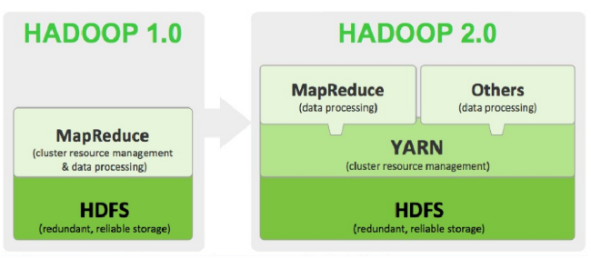

**目录：**

> 1、大数据简介
> 2、Hadoop简介
> 3、Hadoop安装
> 4、坑

###1、大数据简介
---
####1.1、概念
大数据概念早在**1980年**，著名未来学家阿尔文·托夫勒提出的概念。

**2003年到2004年**间，Google发表了*MapReduce*、*GFS(Google File System)*和*BigTable*三篇技术论文，提出了一套全新的分布式计算理论：
- MapReduce是分布式计算框架
- GFS(Google File System)是分布式文件系统
- BigTable是基于Google File System的数据存储系统
这三大组件组成了Google的分布式计算模型，随着谷歌MapReduce和GoogleFile System (GFS)的发布，大数据不再仅用来描述大量的数据，还涵盖了处理数据的速度。

由于Google没有开源Google分布式计算模型的技术实现，所以其他互联网公司只能根据Google三篇技术论文中的相关原理，搭建自己的分布式计算系统。Yahoo的工程师Doug Cutting和Mike Cafarella在**2005年**合作开发了分布式计算系统Hadoop。后来，Hadoop被贡献给了Apache基金会，成为了Apache基金会的开源项目。Doug Cutting也成为Apache基金会的主席，主持Hadoop的开发工作。

**2009年**美国互联网数据中心证实大数据时代的来临。

*大数据(big data)或称巨量资料*：指的是所涉及的资料量规模巨大到无法透过目前主流软件工具在合理时间内获取、管理、处理、并整理为帮助企业经营决策。

*大数据的主要特点*：为数据量大(Volume)，数据类别复杂(Variety)，价值密度(value)和数据处理速度快(Velocity)，合起来被称为4V，如下图：


从表面上看，数据规模的增长为处理数据带来了很大的问题，具体来说，在同样时间内获取与以前相同价值的数据变得不可为了。换言之，本质问题是数据的价值密度变低了，数据交换速率变慢了，所以催生了很多新型数据处理技术和工具
如Hadoop，Spark和Storm是目前最重要的三大分布式计算系统，Hadoop常用于离线的复杂的大数据处理，Spark常用于离线的快速的大数据处理，而Storm常用于在线的实时的大数据处理；出现了对时间敏感程度不同的计算模式，如批式计算模式、交互式计算模式、流计算模式、实时计算模式等。
计算模式的差异只是决定获取价值的技术不同，取决于上层业务需求的不同。实际上，所谓大数据问题的本质应是数据的资产化和服务化，而*挖掘数据的内在价值*是研究大数据的最终目标。

####1.2、大数据分析
主要分为五个方面：可视化分析(Analytic Visualization)、数据挖掘算法(Date Mining Algorithms)、预测性分析能力(Predictive Analytic Capabilities)、语义引擎(Semantic Engines)和数据质量管理(Data Quality Management)。

- 可视化分析是普通消费者常常可以见到的一种大数据分析结果的表现形式，比如说百度制作的“百度地图春节人口迁徙大数据”就是典型的案例之一。可视化分析将大量复杂的数据自动转化成直观形象的图表，使其能够更加容易的被普通消费者所接受和理解。
- 数据挖掘算法是大数据分析的理论核心，其本质是一组根据算法事先定义好的数学公式，将收集到的数据作为参数变量带入其中，从而能够从大量复杂的数据中提取到有价值的信息。著名的“啤酒和尿布”的故事就是数据挖掘算法的经典案例。沃尔玛通过对啤酒和尿布购买数据的分析，挖掘出以前未知的两者间的联系，并利用这种联系，提升了商品的销量。亚马逊的推荐引擎和谷歌的广告系统都大量使用了数据挖掘算法。
- 预测性分析能力是大数据分析最重要的应用领域。从大量复杂的数据中挖掘出规律，建立起科学的事件模型，通过将新的数据带入模型，就可以预测未来的事件走向。预测性分析能力常常被应用在金融分析和科学研究领域，用于股票预测或气象预测等。
- 语义引擎是机器学习的成果之一。过去，计算机对用户输入内容的理解仅仅停留在字符阶段，不能很好的理解输入内容的意思，因此常常不能准确的了解用户的需求。通过对大量复杂的数据进行分析，让计算机从中自我学习，可以使计算机能够尽量精确的了解用户输入内容的意思，从而把握住用户的需求，提供更好的用户体验。苹果的Siri和谷歌的Google Now都采用了语义引擎。
- 数据质量管理是大数据在企业领域的重要应用。为了保证大数据分析结果的准确性，需要将大数据中不真实的数据剔除掉，保留最准确的数据。这就需要建立有效的数据质量管理系统，分析收集到的大量复杂的数据，挑选出真实有效的数据。

####1.3、大数据职位

主要包括数据研发工程师，数据分析师，数据科学家

###2、Hadoop简介
---
####2.1、Hadoop
Hadoop的核心由分布式文件系统HDFS与Map/Reduce计算模型组成,是Apache的一个用java语言实现开源软件框架。Hadoop采用MapReduce分布式计算框架，并根据GFS开发了HDFS分布式文件系统，根据BigTable开发了HBase数据存储系统。尽管和Google内部使用的分布式计算系统原理相同，但是Hadoop在运算速度上依然达不到Google论文中的标准。不过，Hadoop的开源特性使其成为分布式计算系统的事实上的国际标准。Yahoo，Facebook，Amazon以及国内的百度，阿里巴巴等众多互联网公司都以Hadoop为基础搭建自己的分布式计算系统。

####2.2、HDFS
Hadoop Distributed File System(分布式文件系统)，提供了海量数据的存储，大文件被分成默认64M一块的数据块分布存储在集群机器中。

HDFS是一个主从结构的，有主节点和从节点（master/slave），主节点只有一个namenode（可配置备namenode），从节点有很多个datanodes

> namenode负责管理

• 接收用户操作请求，可以实现对文件系统的操作(一般的操作方式有两种，命令行方式和Java API方式)
• 维护文件系统的目录结构(用来对文件进行分类管理)。
• 管理文件与block之间关系(文件被划分成了Block，Block属于哪个文件，以及Block的顺序)，block与datanode之间关系。

> datanode负责存储

• 存储文件
• 文件被分成block(block一般是以64M来划分，但每个Block块所占用的空间是文件实际的空间）存储在磁盘上，将大数据划分成相对较小的block块，这样可以充分利用磁盘空间，方便管理。
• 为保证数据安全，文件会有多个副本(就好比配钥匙，都是为了预防丢失)，这些副本会一块一块复制，分别存储在不同的DataNode上。

####2.3、Map/Reduce
Map/Reduce是一个用于大规模数据处理的分布式计算模型，它的定义是，Map/Reduce是一个编程模型（programmingmodel），是一个用于处理和生成大规模数据集（processing and generating large data sets）的相关的实现。用户定义一个map函数来处理一个key/value对以生成一批中间的key/value对，再定义一个reduce函数将所有这些中间的有着相同key的values合并起来。很多现实世界中的任务都可用这个模型来表达。Key和value的类由于需要支持被序列化（serialize）操作，所以它们必须要实现Writable接口，而且key的类还必须实现WritableComparable接口，使得可以让框架对数据集的执行排序操作。

一个Map-Reduce任务的执行过程以及数据输入输出的类型如下所示：
```
Map：<k1,v1> ->list<k2,v2>
Reduce：<k2,list<v2>> -><k3,v3>
```

####2.4、MapReduce1.0
MapReduce1.0主从结构，主节点只有一个JobTracker，从节点有很多个TaskTrackers

> JobTracker

• 接收客户提交的计算任务
• 把计算任务分给TaskTracker执行
• 监控TaskTracker的执行情况

> TaskTrackers

• 执行JobTracker分配的计算任务

####2.5、MapReduce2.0和Yarn



Hadoop 1.0 JobTracker不但负责资源管理(由TaskScheduler模块实现),还包括作业控制(由JobTracker中多个模块共同实现)两部分，因此JobTracker赋予的功能过多而造成负载过重，从而在可扩展性，资源利用率和多框架支持等方面存在不足。

在第二代MapReduce框架中，将JobTracker的两个主要功能，即资源管理和作业控制(包括作业监控，容错等)分拆成两个独立进程。资源管理进程与具体应用程序无关，它负责整个集群的资源(内存、CPU、磁盘等)管理,而作业控制进程则是直接与应用程序相关的模块,且每个作业控制进程只负责管理一个作业。这样, 通过将原有JobTracker中与应用程序相关和无关的模块分开,不仅减轻了JobTracker负载,也使得Hadoop支持更多的计算框架。

因此在Hadoop2.0产生了YARN资源管理系统，Yarn/MRv2最基本的想法是将原JobTracker主要的资源管理和job调度/监视功能分开作为两个单独的守护进程。有一个全局的ResourceManager(RM)和每个Application有一个ApplicationMaster(AM)，Application相当于map-reduce job或者DAG jobs。ResourceManager和NodeManager(NM)组成了基本的数据计算框架。ResourceManager协调集群的资源利用，任何client或者运行着的applicatitonMaster想要运行job或者task都得向RM申请一定的资源。ApplicatonMaster是一个框架特殊的库，对于MapReduce框架而言有它自己的AM实现，用户也可以实现自己的AM，在运行的时候，AM会与NM一起来启动和监视tasks。 

###3、Hadoop安装
---
####3.1、Hadoop安装方式

- 本地模式（Local (Standalone) Mode）
    默认情况下，Hadoop被配置成以非分布式模式运行的一个独立Java进程，运行于本地文件系统，这对调试非常有帮助。
- 伪分布式模式（Pseudo-Distributed Mode）
    Hadoop可以在单节点上以所谓的伪分布式模式运行，此时每一个Hadoop守护进程都作为一个独立的Java进程运行，运行于hdfs文件系统。
- 全分布式模式（Fully-Distributed Mode）
    适合线上生产环境

####3.2 环境
JDK 7， Hadoop 2.x.y，Linux

####3.3 创建hadoop用户
如果你安装 Ubuntu 的时候不是用的 “hadoop” 用户，那么需要增加一个名为 hadoop 的用户。

首先按 ctrl+alt+t 打开终端窗口，输入如下命令创建新用户 :
```
sudo useradd -m hadoop -s /bin/bash
```
这条命令创建了可以登陆的 hadoop 用户，并使用 /bin/bash 作为 shell。

接着使用如下命令设置密码，可简单设置为 hadoop，按提示输入两次密码：
```
sudo passwd hadoop
```
可为 hadoop 用户增加管理员权限，方便部署，避免一些对新手来说比较棘手的权限问题：
```
sudo adduser hadoop sudo
```
最后注销当前用户，使用刚创建的 hadoop 用户进行登陆。

####3.4 安装 Hadoop2
Hadoop 2 可以通过 http://mirror.bit.edu.cn/apache/hadoop/common/ 或者 http://mirrors.cnnic.cn/apache/hadoop/common/ 下载，一般选择下载最新的稳定版本，即下载 “stable” 下的 hadoop-2.x.y.tar.gz 这个格式的文件，这是编译好的，另一个包含 src 的则是 Hadoop 源代码，需要进行编译才可使用。

下载时强烈建议也下载hadoop-2.x.y.tar.gz.mds这个文件，该文件包含了检验值可用于检查 hadoop-2.x.y.tar.gz 的完整性，否则若文件发生了损坏或下载不完整，Hadoop 将无法正常运行。

本文涉及的文件均通过浏览器下载，默认保存在 “下载” 目录中（若不是请自行更改 tar 命令的相应目录）。
```
cat ~/下载/hadoop-2.6.0.tar.gz.mds | grep 'MD5' # 列出md5检验值
head -n 6 ~/下载/hadoop-2.7.1.tar.gz.mds # 2.7.1版本格式变了，可以用这种方式输出
md5sum ~/下载/hadoop-2.6.0.tar.gz | tr "a-z" "A-Z" # 计算md5值，并转化为大写，方便比较
```

若文件不完整则这两个值一般差别很大，可以简单对比下前几个字符跟后几个字符是否相等即可，如下图所示，如果两个值不一样，请务必重新下载。

我们选择将 Hadoop 安装至 /usr/local/ 中：
```
sudo tar -zxf ~/下载/hadoop-2.6.0.tar.gz -C /usr/local    # 解压到/usr/local中
cd /usr/local/
sudo mv ./hadoop-2.6.0/ ./hadoop            # 将文件夹名改为hadoop
sudo chown -R hadoop ./hadoop 
```

*配置PATH变量:*
在 Master 节点上进行配置，首先执行 vim ~/.bashrc，加入一行：
```
export PATH=$PATH:/usr/local/hadoop/bin:/usr/local/hadoop/sbin
```
保存后执行 source ~/.bashrc 使配置生效。

####3.5 Hadoop单机配置(非分布式)
Hadoop 默认模式为非分布式模式，无需进行其他配置即可运行，非分布式即单Java进程，方便进行调试。

现在我们可以执行例子来感受下 Hadoop 的运行。Hadoop 附带了丰富的例子（运行 ./bin/hadoop jar ./share/hadoop/mapreduce/hadoop-mapreduce-examples-2.6.0.jar 可以看到所有例子），包括 wordcount、terasort、join、grep 等。

在此我们选择运行 grep 例子，我们将input 文件夹中的所有文件作为输入，筛选当中符合正则表达式 dfs[a-z.]+ 的单词并统计出现的次数，最后输出结果到 output 文件夹中。
```
cd /usr/local/hadoop
mkdir ./input
cp ./etc/hadoop/*.xml ./input   # 将配置文件作为输入文件
./bin/hadoop jar ./share/hadoop/mapreduce/hadoop-mapreduce-examples-*.jar grep ./input ./output 'dfs[a-z.]+'
cat ./output/*    
```
执行成功后输出了作业的相关信息，输出的结果是符合正则的单词 dfsadmin 出现了1次

####3.6 网络配置
首先在 Master 节点上完成准备工作，并关闭 Hadoop (/usr/local/hadoop/sbin/stop-dfs.sh)，再进行后续集群配置。

为了便于区分，可以修改各个节点的主机名（在终端标题、命令行中可以看到主机名，以便区分）。在 Ubuntu/CentOS 7 中，我们在 Master 节点上执行如下命令修改主机名（即改为 Master，注意是区分大小写的）：
```
sudo vim /etc/hostname
```

然后执行如下命令修改自己所用节点的IP映射：
```
sudo vim /etc/hosts
```
如上面讲的是 Master 节点的配置，而在其他的 Slave 节点上，也要对 /etc/hostname（修改为 Slave1、Slave2 等） 和 /etc/hosts（跟 Master 的配置一样）这两个文件进行修改！

####3.7 安装SSH、配置SSH无密码登陆
集群、单节点模式都需要用到 SSH 登陆，这个操作是要让 Master 节点可以无密码 SSH 登陆到各个 Slave 节点上。

首先生成 Master 节点的公匙，在 Master 节点的终端中执行（因为改过主机名，所以还需要删掉原有的再重新生成一次）：
```
cd ~/.ssh               # 如果没有该目录，先执行一次ssh localhost
rm ./id_rsa*            # 删除之前生成的公匙（如果有）
ssh-keygen -t rsa       # 一直按回车就可以
```
让 Master 节点需能无密码 SSH 本机，在 Master 节点上执行：
```
cat ./id_rsa.pub >> ./authorized_keys
```
完成后可执行 ssh Master 验证一下（可能需要输入 yes，成功后执行 exit 返回原来的终端）。接着在 Master 节点将上公匙传输到 Slave1 节点：
```
scp ~/.ssh/id_rsa.pub hadoop@Slave1:/home/hadoop/
```
scp 是 secure copy 的简写，用于在 Linux 下进行远程拷贝文件，类似于 cp 命令，不过 cp 只能在本机中拷贝。执行 scp 时会要求输入 Slave1 上 hadoop 用户的密码(hadoop)，输入完成后会提示传输完毕，如下图所示：
接着在 Slave1 节点上，将 ssh 公匙加入授权：
```
mkdir ~/.ssh       # 如果不存在该文件夹需先创建，若已存在则忽略
cat ~/id_rsa.pub >> ~/.ssh/authorized_keys
rm ~/id_rsa.pub    # 用完就可以删掉了
```
如果有其他 Slave 节点，也要执行将 Master 公匙传输到 Slave 节点、在 Slave 节点上加入授权这两步。
```
ssh Slave1
```

####3.8 配置集群/分布式环境
集群/分布式模式需要修改 /usr/local/hadoop/etc/hadoop 中的5个配置文件（更多设置项可点击查看官方说明），这里仅设置了正常启动所必须的设置项： slaves、core-site.xml、hdfs-site.xml、mapred-site.xml、yarn-site.xml 。
#####3.8.1、文件slaves
文件*slaves*将作为DataNode的主机名写入该文件，每行一个，默认为localhost，所以在伪分布式配置时，节点即作为NameNode也作为DataNode。分布式配置可以保留localhost，也可以删掉，让Master节点仅作为NameNode使用。

本教程让 Master 节点仅作为 NameNode 使用，因此将文件中原来的 localhost 删除，只添加一行内容：qm-host-5-2。

#####3.8.2、文件core-site.xml 
改为下面的配置
```
<configuration>
    <property>
            <name>fs.defaultFS</name>
            <value>hdfs://qm-host-5-108:9000</value>
    </property>
    <property>
            <name>hadoop.tmp.dir</name>
            <value>file:/usr/local/hadoop/tmp</value>
            <description>Abase for other temporary directories.</description>
    </property>
</configuration>
```

#####3.8.3、文件 hdfs-site.xml
dfs.replication 一般设为 3，但我们只有一个 Slave 节点，所以 dfs.replication 的值还是设为 1
```
<configuration>
        <property>
                <name>dfs.namenode.secondary.http-address</name>
                <value>qm-host-5-108:50090</value>
        </property>
        <property>
                <name>dfs.replication</name>
                <value>1</value>
        </property>
        <property>
                <name>dfs.namenode.name.dir</name>
                <value>file:/usr/local/hadoop/tmp/dfs/name</value>
        </property>
        <property>
                <name>dfs.datanode.data.dir</name>
                <value>file:/usr/local/hadoop/tmp/dfs/data</value>
        </property>
</configuration>
```

#####3.8.4、文件 mapred-site.xml 
可能需要先重命名，默认文件名为 mapred-site.xml.template，然后配置修改如下
```
<configuration>
        <property>
                <name>mapreduce.framework.name</name>
                <value>yarn</value>
        </property>
        <property>
                <name>mapreduce.jobhistory.address</name>
                <value>qm-host-5-108:10020</value>
        </property>
        <property>
                <name>mapreduce.jobhistory.webapp.address</name>
                <value>qm-host-5-108:19888</value>
        </property>
</configuration>
```
#####3.8.5、文件 yarn-site.xml
yarn.nodemanager.aux-services为了能够运行MapReduce程序，需要让各个NodeManager在启动时加载shuffle server，shuffle server实际上是Jetty/Netty Server，Reduce Task通过该server从各个NodeManager上远程拷贝Map Task产生的中间结果
```
<configuration>
        <property>
                <name>yarn.resourcemanager.hostname</name>
                <value>qm-host-5-108</value>
        </property>
        <property>
                <name>yarn.nodemanager.aux-services</name>
                <value>mapreduce_shuffle</value>
        </property>
</configuration>
```

#####3.8.6、复制到slave
配置好后，将 Master 上的 /usr/local/Hadoop 文件夹复制到各个节点上。因为之前有跑过伪分布式模式，建议在切换到集群模式前先删除之前的临时文件。在Master 节点上执行：
```
cd /usr/local
sudo rm -r ./hadoop/tmp     # 删除 Hadoop 临时文件
sudo rm -r ./hadoop/logs/*   # 删除日志文件
tar -zcf ~/hadoop.master.tar.gz ./hadoop   # 先压缩再复制
cd ~
scp ./hadoop.master.tar.gz Slave1:/home/hadoop
```
在 Slave1 节点上执行：
```
sudo rm -r /usr/local/hadoop    # 删掉旧的（如果存在）
sudo tar -zxf ~/hadoop.master.tar.gz -C /usr/local
sudo chown -R hadoop /usr/local/hadoop
```
同样，如果有其他 Slave 节点，也要执行将hadoop.master.tar.gz 传输到 Slave 节点、在 Slave 节点解压文件的操作。

####3.9 启动分布式环境
首次启动需要先在 Master节点执行 NameNode 的格式化：
```
hdfs namenode -format       # 首次运行需要执行初始化，之后不需要
```
接着可以启动 hadoop 了，启动需要在 Master 节点上进行：
```
start-dfs.sh
start-yarn.sh
mr-jobhistory-daemon.sh start historyserver
```
通过命令 jps 可以查看各个节点所启动的进程。正确的话，在 Master 节点上可以看到 NameNode、ResourceManager、SecondrryNameNode、JobHistoryServer 进程，如下图所示：

在 Slave 节点可以看到 DataNode 和 NodeManager 进程，如下图所示：


也可以通过 Web 页面看到查看 DataNode 和 NameNode 的状态：http://192.168.5.108:50070/。如果不成功，可以通过启动日志排查原因。

####3.10 执行分布式实例
执行分布式实例过程，首先创建 HDFS 上的用户目录：
```
hdfs dfs -mkdir -p /user/hadoop
```

将 /usr/local/hadoop/etc/hadoop 中的配置文件作为输入文件复制到分布式文件系统中：
```
hdfs dfs -mkdir input
hdfs dfs -put /usr/local/hadoop/hadoop-2.7.3/etc/hadoop/*.xml input
```

查看和删除分布式文件
```
hdfs dfs -ls input
hdfs dfs -rm input/*.xml
```

接着就可以运行 MapReduce 作业了：
```
hadoop jar ncdc/qianmo-server.jar com.qianmo.demo.hadoop.MaxTemperature input/1901 output
hadoop jar ncdc/qianmo-server.jar com.qianmo.demo.hadoop.MaxTemperature input output
```

可以通过Web界面查看任务进度http://192.168.5.108:8088/cluster，关闭 Hadoop集群也是在Master节点上执行的：
```
stop-yarn.sh
stop-dfs.sh
mr-jobhistory-daemon.sh stop historyserver
```

###4、坑
---
####4.1、Error: JAVA_HOME is not set and could not be found.
>可能除了修改系统环境变量外，还需要修改hadoop_env.sh配置文件

####4.2、dfs.namenode.servicerpc-address or dfs.namenode.rpc-address is not configured
>主机名不能有下划线，否则启动时，SecondaryNameNode节点会报如下所示的错误（取自hadoop-hadoop-secondarynamenode-VM_39_166_sles10_64.out文件）,但是实际报的是dfs.namenode.servicerpc-address or dfs.namenode.rpc-address is not configured

```
Exception in thread "main" java.lang.IllegalArgumentException: Does not contain a valid hostort authority: hdfs://hadoop_master:9000
        at org.apache.hadoop.net.NetUtils.createSocketAddr(NetUtils.java:164)
        at org.apache.hadoop.hdfs.server.namenode.NameNode.getAddress(NameNode.java:212)
        at org.apache.hadoop.hdfs.server.namenode.NameNode.getAddress(NameNode.java:244)
        at org.apache.hadoop.hdfs.server.namenode.NameNode.getServiceAddress(NameNode.java:236)
        at org.apache.hadoop.hdfs.server.namenode.SecondaryNameNode.initialize(SecondaryNameNode.java:194)
        at org.apache.hadoop.hdfs.server.namenode.SecondaryNameNode.<init>(SecondaryNameNode.java:150)
        at org.apache.hadoop.hdfs.server.namenode.SecondaryNameNode.main(SecondaryNameNode.java:676)
```
####4.3、org.apache.hadoop.yarn.server.nodemanager.containermanager.AuxServices: Failed to initialize mapreduce.shuffle
yarn.nodemanager.aux-services项的默认值是“mapreduce.shuffle”，但如果在hadoop-2.2 中继续使用这个值，NodeManager 会启动失败，报此错，解决方案：将yarn.nodemanager.aux-services项的值改为“mapreduce_shuffle”。

参考:

- [Hadoop安装教程_单机/伪分布式配置_Hadoop2.6.0/Ubuntu14.04](http://www.powerxing.com/install-hadoop/)
- [Hadoop-2.7.2分布式安装手册.pdf](http://m.blog.chinaunix.net/uid-20682147-id-5520795.html)
