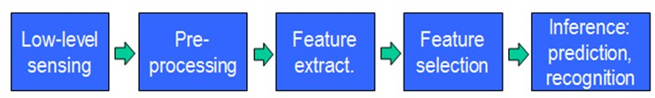

###1、机器学习
---
机器学习（Machine Learning）:是一门专门研究计算机怎样模拟或实现人类的学习行为，以获取新的知识或技能，重新组织已有的知识结构使之不断改善自身的性能的学科。
目前我们通过机器学习去解决这些问题的思路都是这样的（以视觉感知为例子）：

从开始的通过传感器（例如CMOS）来获得数据。然后经过预处理、特征提取、特征选择，再到推理、预测或者识别。最后一个部分，也就是机器学习的部分，绝大部分的工作是在这方面做的，也存在很多的paper和研究。
而中间的三部分，概括起来就是特征表达。良好的**特征表达**，对最终算法的准确性起了非常关键的作用，而且系统主要的计算和测试工作都耗在这一大部分。但，这块实际中一般都是人工完成的。靠人工提取特征。

###2、Deep Learning
然而，手工地选取特征是一件非常费力、启发式（需要专业知识）的方法，能不能选取好很大程度上靠经验和运气，而且它的调节需要大量的时间。既然手工选取特征不太好，那么能不能自动地学习一些特征呢？答案是能！Deep Learning就是用来干这个事情的，看它的一个别名UnsupervisedFeature Learning，就可以顾名思义了，Unsupervised的意思就是不要人参与特征的选取过程。

总的来说，人的视觉系统的信息处理是分级的。从低级的V1区提取边缘特征，再到V2区的形状或者目标的部分等，再到更高层，整个目标、目标的行为等。也就是说高层的特征是低层特征的组合，从低层到高层的特征表示越来越抽象，越来越能表现语义或者意图。而抽象层面越高，存在的可能猜测就越少，就越利于分类。例如，单词集合和句子的对应是多对一的，句子和语义的对应又是多对一的，语义和意图的对应还是多对一的，这是个层级体系。

敏感的人注意到关键词了：分层。而Deep learning的deep是不是就表示我存在多少层，也就是多深呢？没错。那Deep learning是如何借鉴这个过程的呢？毕竟是归于计算机来处理，面对的一个问题就是怎么对这个过程建模？

因为我们要学习的是特征的表达，那么关于特征，或者说关于这个层级特征，我们需要了解地更深入点。所以在说Deep Learning之前，我们有必要再啰嗦下特征（呵呵，实际上是看到那么好的对特征的解释，不放在这里有点可惜，所以就塞到这了）。

###3、关于特征
特征是机器学习系统的原材料，对最终模型的影响是毋庸置疑的。如果数据被很好的表达成了特征，通常线性模型就能达到满意的精度。那对于特征，我们需要考虑什么呢？

###9、实战
手机传感器拍照--》特征提取，SIFT（Scale-invariant feature transform）--》机器学习

[Deep Learning（深度学习）学习笔记整理系列之（一）](http://blog.csdn.net/zouxy09/article/details/8775360)