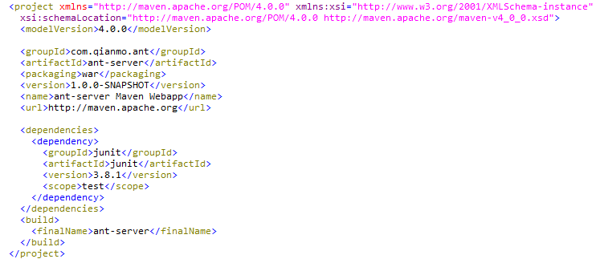
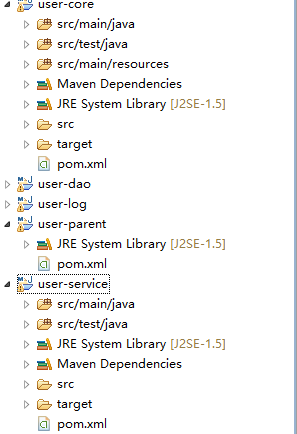

### 1、maven
---
#### 1.1、maven安装和配置
简单讲下maven的安装步骤：
1. 在安装maven之前，先确保已经安装JDK1.6及以上版本，并且配置好环境变量。
2. 下载maven3，最新版本是Maven3.1.1 ，下载地址：http://maven.apache.org/download.html,下载apache-maven-3.1.1-bin.zip文件后，并解压到  D:\maven\apache-maven-3.1.1
3. 配置maven3的环境变量：先配置M2_HOME的环境变量，新建一个系统变量：M2_HOME , 路径是：D:\cloud_cms\maven\apache-maven-3.1.1,再配置path环境变量，在path值的末尾添加"%M2_HOME%\bin"
4. 点击确定之后，打开cmd窗口：输入 mvn -version,验证是否安装成功。

给maven添加本地仓库
1. 打开本地maven安装目录,比如我的本地存放目录是：D:\Util\maven\apache-maven-3.1.1
2. 打开conf文件夹下的settings.xml文件，找到第53行，把注释去掉，修改成：
<localRepository>D:/Util/maven/maven-dependcies</localRepository>
当然了，前提是在某个路径下，手动建立了一个名为 maven-dependcies的文件夹，然后把本地仓库指向该路径。

#### 1.2、POM基础
##### 1.2.1、Simple POM(坐标)


|节点 |	描述 |
| ------------- |:-------------:|
|groupId	|这是工程组的标识。它在一个组织或者项目中通常是唯一的。例如，一个银行组织 com.company.bank 拥有所有的和银行相关的项目。|
|artifactId	|这是工程的标识。它通常是工程的名称。例如，消费者银行。groupId 和 artifactId 一起定义了 artifact 在仓库中的位置。|
|version	|这是工程的版本号。在 artifact 的仓库中，它用来区分不同的版本。例如：com.company.bank:consumer-banking:1.0 com.company.bank:consumer-banking:1.1.|
|packaging	|项目产生的构件类型，例如jar、war、ear、pom。插件可以创建他们自己的构件类型，所以前面列的不是全部构件类型|
|name	|项目的名称, Maven产生的文档用|
|url	|项目主页的URL, Maven产生的文档用|

##### 1.2.2、Super POM
所有的 POM 都继承自一个父 POM（无论是否显式定义了这个父 POM）。父 POM 也被称作 Super POM，它包含了一些可以被继承的默认设置。

effective pom:Super pom 加上工程自己的配置,命令：mvn help:effective-pom

##### 1.2.3、Full POM
```xml
<project xmlns="http://maven.apache.org/POM/4.0.0"
  xmlns:xsi="http://www.w3.org/2001/XMLSchema-instance"
  xsi:schemaLocation="http://maven.apache.org/POM/4.0.0
                      http://maven.apache.org/xsd/maven-4.0.0.xsd">
  <modelVersion>4.0.0</modelVersion>
 
  <!-- The Basics -->
  <groupId>...</groupId>
  <artifactId>...</artifactId>
  <version>...</version>
  <packaging>...</packaging>
  <dependencies>...</dependencies>
  <parent>...</parent>
  <dependencyManagement>...</dependencyManagement>
  <modules>...</modules>
  <properties>...</properties>
 
  <!-- Build Settings -->
  <build>...</build>
  <reporting>...</reporting>
 
  <!-- More Project Information -->
  <name>...</name>
  <description>...</description>
  <url>...</url>
  <inceptionYear>...</inceptionYear>
  <licenses>...</licenses>
  <organization>...</organization>
  <developers>...</developers>
  <contributors>...</contributors>
 
  <!-- Environment Settings -->
  <issueManagement>...</issueManagement>
  <ciManagement>...</ciManagement>
  <mailingLists>...</mailingLists>
  <scm>...</scm>
  <prerequisites>...</prerequisites>
  <repositories>...</repositories>
  <pluginRepositories>...</pluginRepositories>
  <distributionManagement>...</distributionManagement>
  <profiles>...</profiles>
</project>
```

#### 1.3、构建生命周期（Build Lifecycle）
##### 1.3.1、概念
构建生命周期（Build Lifecycle）、阶段（Phase）、插件(Plugin)、目标（Goal）:
构建生命周期由多个有序的构建阶段（sequence of phases）组成，一个构建阶段（Phase）可以绑定一个或者多个的目标。构建生命周期和阶段只是抽象的概念，不涉及具体的功能。 具体的功能由插件（Plugin）实现,一个插件可以实现多个目标（Goal）。而maven默认将某些目标自动绑定到某些阶段，只要进行了绑定，执行阶段时，自动就会执行该目标。

例如：
mvn package
这条命令执行的是default生命周期中的package阶段，而这个阶段默认绑定了maven-jar-plugin的jar目标（即jar:jar），所以执行这个阶段就会调用该插件jar目标所做的事情，也就是创建项目的jar包。当然也可以直接执行目标，比如：mvn dependency:copy-dependencies
这里dependency是插件的名称，copy-denpendencies是插件的目标。
如果需要将某个目标绑定到某个阶段，在POM文件中配置插件即可。

Maven 有以下三个标准的构建生命周期:

- clean: 主要目的是清理项目
- default(or build)：定义了真正构建时所需要执行的所有步骤，它是生命周期中最核心的部分
- site: 生成项目站点文档

##### 1.3.2、Clean 生命周期
- pre-clean
- clean
- post-clean

##### 1.3.3、Default (or Build) 生命周期
这是 Maven 的主要生命周期，被用于构建应用。

|阶段	|处理	|描述|
| ------------- |:-------------:|-------------:|
|prepare-resources|	资源拷贝	|本阶段可以自定义需要拷贝的资源|
|compile	|编译	|本阶段完成源代码编译|
|package	|打包	|本阶段根据 pom.xml 中描述的打包配置创建 JAR / WAR 包|
|install	|安装	|本阶段在本地 / 远程仓库中安装工程包|

##### 1.3.4、Site 生命周期
Maven Site 插件一般用来创建新的报告文档、部署站点等。

#### 1.4、dependencies 
##### 1.4.1、仓库
Maven 仓库有三种类型：

- 本地（local）
- 中央（central）:http://search.maven.org/#browse
- 远程（remote）
- 私服

##### 1.4.2、依赖管理
通过传递依赖，所有被包含的库的图形可能会快速的增长。当重复的库存在时，可能出现的情形将会持续上升。Maven 提供一些功能来控制可传递的依赖的程度。

|功能	|功能描述|
| ------------- |:-------------:|
|依赖调节	|决定当多个手动创建的版本同时出现时，哪个依赖版本将会被使用。 如果两个依赖版本在依赖树里的深度是一样的时候，第一个被声明的依赖将会被使用。|
|依赖管理	|直接的指定手动创建的某个版本被使用。例如当一个工程 C 在自己的以来管理模块包含工程 B，即 B 依赖于 A， 那么A 即可指定在 B 被引用时所使用的版本。|
|依赖范围	|包含在构建过程每个阶段的依赖。|
|依赖排除	|任何可传递的依赖都可以通过 "exclusion" 元素被排除在外。举例说明，A 依赖 B， B 依赖 C，因此 A 可以标记 C 为 “被排除的”。|
|依赖可选	|任何可传递的依赖可以被标记为可选的，通过使用 "optional" 元素。例如：A 依赖 B， B 依赖 C。因此，B 可以标记 C 为可选的， 这样 A 就可以不再使用 C。|

maven scope:

|范围	|描述|
| ------------- |:-------------:|
|compile编译阶段	|如果没有提供一个范围，那该依赖的范围就是编译范围。编译范围依赖在所有的classpath 中可用，同时它们也会被打包。|
|provided供应阶段	|provided 依赖只有在当JDK 或者一个容器已提供该依赖之后才使用。例如， 如果你开发了一个web 应用，你可能在编译 classpath 中需要可用的Servlet API 来编译一个servlet，但是你不会想要在打包好的WAR 中包含这个Servlet API；这个Servlet API JAR 由你的应用服务器或者servlet 容器提供。已提供范围的依赖在编译classpath （不是运行时）可用。它们不是传递性的，也不会被打包。|
|runtime运行阶段	|runtime 依赖在运行和测试系统的时候需要，但在编译的时候不需要。比如，你可能在编译的时候只需要JDBC API JAR，而只有在运行的时候才需要JDBC驱动实现。|
|test测试阶段	|test范围依赖 在一般的编译和运行时都不需要，它们只有在测试编译和测试运行阶段可用。|
|system系统阶段	|system范围依赖与provided 类似，但是你必须显式的提供一个对于本地系统中JAR 文件的路径。这么做是为了允许基于本地对象编译，而这些对象是系统类库的一部分。这样的构件应该是一直可用的，Maven 也不会在仓库中去寻找它。如果你将一个依赖范围设置成系统范围，你必须同时提供一个 systemPath 元素。注意该范围是不推荐使用的（你应该一直尽量去从公共或定制的 Maven 仓库中引用依赖）。|

##### 1.4.3、外部依赖
通常情况下它会包含一些任何仓库无法使用，并且 maven 也无法下载的 jar 文件。如果你的代码正在使用这个库，那么 Maven 的构建过程将会失败，因为在编译阶段它不能下载或者引用这个库。
```xml
 <dependency>
             <groupId>ldapjdk</groupId>
             <artifactId>ldapjdk</artifactId>
             <scope>system</scope>
             <version>1.0</version>
             <systemPath>${basedir}\src\lib\ldapjdk.jar</systemPath>
          </dependency>
```

##### 1.4.4、快照（snapshot）
快照是一个特殊的版本，它表示当前开发的一个副本。与常规版本不同，Maven 为每一次构建从远程仓库中检出一份新的快照版本。

快照 vs 版本:
对于版本，Maven 一旦下载了指定的版本（例如 data-service:1.0），它将不会尝试从仓库里再次下载一个新的 1.0 版本。想要下载新的代码，数据服务版本需要被升级到 1.1。

对于快照，每次用户接口团队构建他们的项目时，Maven 将自动获取最新的快照（data-service:1.0-SNAPSHOT）。

#### 1.5、maven插件
Maven 实际上是一个依赖插件执行的框架，每个任务实际上是由插件完成：

- 创建 jar 文件
- 创建 war 文件
- 编译代码文件
- 代码单元测试
- 创建工程文档
- 创建工程报告

插件通常提供了一个目标的集合，并且可以使用下面的语法执行：
mvn [plugin-name]:[goal-name]

使用的插件助手插件：maven-help-plugin

#### 1.6、build配置
##### 1.6.1、Build Settings
根据POM 4.0.0 XSD，build元素概念性的划分为两个部分：BaseBuild（包含poject build和profile build的公共部分，见下）和poject build包含的一些高级特性。

```xml
<project xmlns="http://maven.apache.org/POM/4.0.0"  
        xmlns:xsi="http://www.w3.org/2001/XMLSchema-instance"  
        xsi:schemaLocation="http://maven.apache.org/POM/4.0.0  
                        http://maven.apache.org/xsd/maven-4.0.0.xsd">  
    ...  
    <!-- "Project Build" contains more elements than just the BaseBuild set -->  
    <build>...</build>  
  
  
    <profiles>  
        <profile>  
            <!-- "Profile Build" contains a subset of "Project Build"s elements -->  
            <build>...</build>  
        </profile>  
    </profiles>  
</project>  
```
1. The BaseBuild Element Set:
```xml
<build>
  <defaultGoal>install</defaultGoal>
  <directory>${basedir}/target</directory>
  <finalName>${artifactId}-${version}</finalName>
  <filters>
    <filter>filters/filter1.properties</filter>
  </filters>
  ...
</build>
```

2. Resources
```xml
 <build>
    ...
    <resources>
      <resource>
        <targetPath>META-INF/plexus</targetPath>
        <filtering>false</filtering>
        <directory>${basedir}/src/main/plexus</directory>
        <includes>
          <include>configuration.xml</include>
        </includes>
        <excludes>
          <exclude>**/*.properties</exclude>
        </excludes>
      </resource>
    </resources>
    <testResources>
      ...
    </testResources>
    ...
  </build>
```

3. Plugins和Plugin Management:
pluginManagement的元素的配置和plugins的配置是一样的，只是这里的配置只是用于集成，在孩子POM中指定使用。

4. The Build Element Set:
```xml
 <build>
    <sourceDirectory>${basedir}/src/main/java</sourceDirectory>
    <scriptSourceDirectory>${basedir}/src/main/scripts</scriptSourceDirectory>
    <testSourceDirectory>${basedir}/src/test/java</testSourceDirectory>
    <outputDirectory>${basedir}/target/classes</outputDirectory>
    <testOutputDirectory>${basedir}/target/test-classes</testOutputDirectory>
    ...
  </build>
```

##### 1.6.2、构建自动化
在 bus-core-api 的 pom 文件里添加一个编译目标来提醒 app-web-ui 工程和 app-desktop-ui 工程启动创建。
使用一个持续集成（CI）的服务器，比如 Hudson，来实现自动化创建。

##### 1.6.3、自动化部署
一般情况下，在一个工程开发进程里，一次部署的过程包含需如下步骤：

- 合入每个子工程下的代码到 SVN 或者源代码库，并标记它。
- 从 SVN 下载完整的源代码。
- 构建应用程序。
- 保存构建结果为 WAR 或者 EAR 类型文件并存放到一个共同的指定的网络位置上。
- 从网络上获得该文件并且部署该文件到产品线上。
- 更新文档日期和应用程序的版本号。

#### 1.7、maven聚合和继承
我们使用Maven应用到实际项目的时候，需要将项目分成不同的模块。这个时候，Maven的聚合特性能够把项目的各个模块聚合在一起构件，而Maven的继承特性则能帮助抽取各模块相同的依赖和插件等配置。在简化POM的同时，还能促进各个模块配置的一致性。下面以具体项目来讲解:

user-parent的pom.xml详情如下:
```xml
<project xmlns="http://maven.apache.org/POM/4.0.0" xmlns:xsi="http://www.w3.org/2001/XMLSchema-instance"
  xsi:schemaLocation="http://maven.apache.org/POM/4.0.0 http://maven.apache.org/xsd/maven-4.0.0.xsd">
  <modelVersion>4.0.0</modelVersion>

  <groupId>com.liangbo.user</groupId>
  <artifactId>user-parent</artifactId>
  <version>0.0.1-SNAPSHOT</version>
  <packaging>pom</packaging>

  <modules>
      <module>../user-core</module>
      <module>../user-dao</module>
      <module>../user-log</module>
      <module>../user-service</module>
  </modules>
  
  <properties>
    <project.build.sourceEncoding>UTF-8</project.build.sourceEncoding>
    <junit.version>4.10</junit.version>
    <mysql.driver>com.mysql.jdbc.Driver</mysql.driver>
    <mysql.url>jdbc:mysql://localhost:3306/mysql</mysql.url>
    <mysql.username>root</mysql.username>
    <mysql.password>password</mysql.password>
  </properties>
  
  <dependencyManagement>  
  </dependencyManagement>
  
  <build>
      <pluginManagement>
      </pluginManagement>
  </build>
</project>
```

下面来看下user-core项目pom.xml的配置:
```xml
<project xmlns="http://maven.apache.org/POM/4.0.0" xmlns:xsi="http://www.w3.org/2001/XMLSchema-instance"
  xsi:schemaLocation="http://maven.apache.org/POM/4.0.0 http://maven.apache.org/xsd/maven-4.0.0.xsd">
  <modelVersion>4.0.0</modelVersion>

  <parent>
      <groupId>com.liangbo.user</groupId>
      <artifactId>user-parent</artifactId>
      <version>0.0.1-SNAPSHOT</version>
      <relativePath>../user-parent/pom.xml</relativePath>
  </parent> 

  <artifactId>user-core</artifactId>
  <packaging>jar</packaging>

  <name>user-core</name>
  <url>http://maven.apache.org</url>

  <dependencies>
  </dependencies>
  
  <build>
      <plugins>
      </plugins>
  </build>
</project>
```

#### 1.8、profile
构建配置文件是一组配置的集合，用来设置或者覆盖 Maven 构建的默认配置,使用构建配置文件，可以为不同的环境定制构建过程，例如 Producation 和 Development 环境，在profile里几乎可以定义所有在pom里的定义的内容（<dependencies>，<properties>，插件配置等等，不过不能再定义他自己了）。当一个profile被激活时，它定义的<dependencies>，<properties>等就会覆盖掉原pom里定义的相同内容，从而可以通过激活不同的profile来使用不同的配置。
```xml
<profiles>
      <profile>
      <id>test</id>
      <build>
      <plugins>
         <plugin>
            <groupId>org.apache.maven.plugins</groupId>
            <artifactId>maven-antrun-plugin</artifactId>
            <version>1.1</version>
            <executions>
               <execution>
                  <phase>test</phase>
                  <goals>
                     <goal>run</goal>
                  </goals>
                  <configuration>
                  <tasks>
                     <echo>Using env.test.properties</echo>
            <copy file="src/main/resources/env.test.propertiestofile
            ="${project.build.outputDirectory}/env.properties"/>
                  </tasks>
                  </configuration>
               </execution>
            </executions>
         </plugin>
      </plugins>
      </build>
      </profile>
   </profiles>
```
Profile 激活，Maven 的 Profile 能够通过几种不同的方式激活。
- 显式使用命令控制台输入
- 通过 maven 设置
- 基于环境变量（用户 / 系统变量）
- 操作系统配置（例如，Windows family）
- 现存 / 缺失 文件

#### 1.9、demo
##### 1.9.1、create project
Maven 使用原型（archetype）插件创建web工程，执行:

mvn archetype:generate -DgroupId=com.qianmo.demo -DartifactId=demo-server -Dversion=1.0.0-SNAPSHOT -DarchetypeArtifactId=maven-archetype-webapp -DinteractiveMode=false

##### 1.9.2、import maven project

1. 通过idea new菜单，import maven项目
2. idea 设置
Import Maven projects automatically; add java package
3. 集成tomcat

参考:

- [Maven教程](http://wiki.jikexueyuan.com/project/maven/repositories.html)
- [POM Reference](https://maven.apache.org/pom.html#Build_Settings)