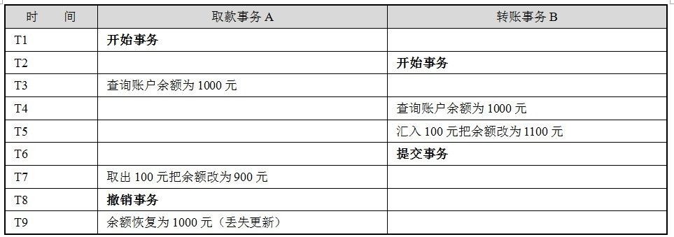

Spring虽然提供了灵活方便的事务管理功能，但这些功能都是基于底层数据库本身的事务处理机制工作的。要深入了解Spring的事务管理和配置，有必要先对数据库事务的基础知识进行学习。 
### 一.何为数据库事务
“一荣俱荣，一损俱损”这句话很能体现事务的思想，很多复杂的事物要分步进行，但它们组成一个整体，要么整体生效，要么整体失效。这种思想反映到数据库上，就是多个SQL语句，要么所有执行成功，要么所有执行失败。
数据库事务有严格的定义，它必须同时满足 4 个特性：原子性（Atomic）、一致性（Consistency）、隔离性（Isolation）和持久性（Durabiliy），简称为ACID。下面是对每个特性的说明。
1. 原子性：表示组成一个事务的多个数据库操作是一个不可分割的原子单元，只有所有的操作执行成功，整个事务才提交，事务中任何一个数据库操作失败，已经执行的任何操作都必须撤销，让数据库返回到初始状态。
2. 一致性：事务操作成功后，数据库所处的状态和它的业务规则是一致的，即数据不会被破坏。如从A账户转账100元到B账户，不管操作成功与否，A和B的存款总额是不变的。
3. 隔离性：在并发数据操作时，不同的事务拥有各自的数据空间，它们的操作不会对对方产生干扰。准确地说，并非要求做到完全无干扰，数据库规定了多种事务隔离级别，不同隔离级别对应不同的干扰程度，隔离级别越高，数据一致性越好，但并发性越弱。
4. 持久性：一旦事务提交成功后，事务中所有的数据操作都必须被持久化到数据库中，即使提交事务后，数据库马上崩溃，在数据库重启时，也必须能保证能够通过某种机制恢复数据。
在这些事务特性中，数据“一致性”是最终目标，其他的特性都是为达到这个目标的措施、要求或手段。 
数据库管理系统一般采用重执行日志保证原子性、一致性和持久性，重执行日志记录了数据库变化的每一个动作，数据库在一个事务中执行一部分操作后发生错误退出，数据库即可以根据重执行日志撤销已经执行的操作。此外，对于已经提交的事务，即使数据库崩溃，在重启数据库时也能够根据日志对尚未持久化的数据进行相应的重执行操作。 
和Java程序采用对象锁机制进行线程同步类似，数据库管理系统采用数据库锁机制保证事务的隔离性。当多个事务试图对相同的数据进行操作时，只有持有锁的事务才能操作数据，直到前一个事务完成后，后面的事务才有机会对数据进行操作。Oracle数据库还使用了数据版本的机制，在回滚段为数据的每个变化都保存一个版本，使数据的更改不影响数据的读取。

### 二.数据并发的问题
一个数据库可能拥有多个访问客户端，这些客户端都可以并发方式访问数据库。数据库中的相同数据可能同时被多个事务访问，如果没有采取必要的隔离措施，就会导致各种并发问题，破坏数据的完整性。这些问题可以归结为5类，包括3类数据读问题（脏读、不可重复读和幻象读）以及2类数据更新问题（第一类丢失更新和第二类丢失更新）。下面，我们分别通过实例讲解引发问题的场景。 
1.脏读（dirty read）
A事务读取B事务尚未提交的更改数据，并在这个数据的基础上操作。如果恰巧B事务回滚，那么A事务读到的数据根本是不被承认的。来看取款事务和转账事务并发时引发的脏读场景：

在这个场景中，B希望取款500元而后又撤销了动作，而A往相同的账户中转账100元，就因为A事务读取了B事务尚未提交的数据，因而造成账户白白丢失了500元。在Oracle数据库中，不会发生脏读的情况。 
引用：一个有结巴的人在饮料店柜台前转悠，老板很热情地迎上来说：“喝一瓶？”结巴连忙说：“我…喝…喝…”老板麻利地打开易拉罐递给结巴，结巴终于憋出了他的那句话：“我…喝…喝…喝不起啊！”

2.不可重复读（unrepeatable read）
不可重复读是指A事务读取了B事务已经提交的更改数据。假设A在取款事务的过程中，B往该账户转账100元，A两次读取账户的余额发生不一致： 

 在同一事务中，T4时间点和T7时间点读取账户存款余额不一样。 

3.幻象读（phantom read）
A事务读取B事务提交的新增数据，这时A事务将出现幻象读的问题。幻象读一般发生在计算统计数据的事务中，举一个例子，假设银行系统在同一个事务中，两次统计存款账户的总金额，在两次统计过程中，刚好新增了一个存款账户，并存入100元，这时，两次统计的总金额将不一致：

如果新增数据刚好满足事务的查询条件，这个新数据就进入了事务的视野，因而产生了两个统计不一致的情况。 
幻象读和不可重复读是两个容易混淆的概念，前者是指读到了其他已经提交事务的新增数据，而后者是指读到了已经提交事务的更改数据（更改或删除），为了避免这两种情况，采取的对策是不同的，防止读取到更改数据，只需要对操作的数据添加行级锁，阻止操作中的数据发生变化，而防止读取到新增数据，则往往需要添加表级锁——将整个表锁定，防止新增数据（Oracle使用多版本数据的方式实现）。  

4.第一类丢失更新
A事务撤销时，把已经提交的B事务的更新数据覆盖了。这种错误可能造成很严重的问题，通过下面的账户取款转账就可以看出来： 

 A事务在撤销时，“不小心”将B事务已经转入账户的金额给抹去了。 

5.第二类丢失更新
A事务覆盖B事务已经提交的数据，造成B事务所做操作丢失： 

 上面的例子里由于支票转账事务覆盖了取款事务对存款余额所做的更新，导致银行最后损失了100元，相反如果转账事务先提交，那么用户账户将损失100元。 

### 三.数据库锁机制
数据并发会引发很多问题，在一些场合下有些问题是允许的，但在另外一些场合下可能却是致命的。数据库通过锁的机制解决并发访问的问题，虽然不同的数据库在实现细节上存在差别，但原理基本上是一样的。 
按锁定的对象的不同，一般可以分为表锁定和行锁定，前者对整个表进行锁定，而后者对表中特定行进行锁定。从并发事务锁定的关系上看，可以分为共享锁定和独占锁定。共享锁定会防止独占锁定，但允许其他的共享锁定。而独占锁定既防止其他的独占锁定，也防止其他的共享锁定。为了更改数据，数据库必须在进行更改的行上施加行独占锁定，INSERT、UPDATE、DELETE和SELECT FOR UPDATE语句都会隐式采用必要的行锁定。下面我们介绍一下Oracle数据库常用的5种锁定。 
行共享锁定：一般通过SELECT FOR UPDATE语句隐式获得行共享锁定，在Oracle中用户也可以通过LOCK TABLE IN ROW SHARE MODE语句显式获得行共享锁定。行共享锁定并不防止对数据行进行更改的操作，但是可以防止其他会话获取独占性数据表锁定。允许进行多个并发的行共享和行独占性锁定，还允许进行数据表的共享或者采用共享行独占锁定。
行独占锁定：通过一条INSERT、UPDATE或DELETE语句隐式获取，或者通过一条LOCK TABLE IN ROW EXCLUSIVE MODE语句显式获取。这个锁定可以防止其他会话获取一个共享锁定、共享行独占锁定或独占锁定。
 表共享锁定：通过LOCK TABLE IN SHARE MODE语句显式获得。这种锁定可以防止其他会话获取行独占锁定（INSERT、UPDATE或DELETE），或者防止其他表共享行独占锁定或表独占锁定，它允许在表中拥有多个行共享和表共享锁定。该锁定可以让会话具有对表事务级一致性访问，因为其他会话在用户提交或者回溯该事务并释放对该表的锁定之前不能更改这个被锁定的表。
表共享行独占：通过LOCK TABLE IN SHARE ROW EXCLUSIVE MODE语句显式获得。这种锁定可以防止其他会话获取一个表共享、行独占或者表独占锁定，它允许其他行共享锁定。这种锁定类似于表共享锁定，只是一次只能对一个表放置一个表共享行独占锁定。如果A会话拥有该锁定，则B会话可以执行SELECT FOR UPDATE操作，但如果B会话试图更新选择的行，则需要等待。
 表独占：通过LOCK TABLE IN EXCLUSIVE MODE显式获得。这个锁定防止其他会话对该表的任何其他锁定。

### 四.事务隔离级别
尽管数据库为用户提供了锁的DML操作方式，但直接使用锁管理是非常麻烦的，因此数据库为用户提供了自动锁机制。只要用户指定会话的事务隔离级别，数据库就会分析事务中的SQL语句，然后自动为事务操作的数据资源添加上适合的锁。此外数据库还会维护这些锁，当一个资源上的锁数目太多时，自动进行锁升级以提高系统的运行性能，而这一过程对用户来说完全是透明的。 
ANSI/ISO SQL 92标准定义了4个等级的事务隔离级别，在相同数据环境下，使用相同的输入，执行相同的工作，根据不同的隔离级别，可以导致不同的结果。不同事务隔离级别能够解决的数据并发问题的能力是不同的，如下表所示。 

 事务的隔离级别和数据库并发性是对立的，两者此增彼长。一般来说，使用READ UNCOMMITED隔离级别的数据库拥有最高的并发性和吞吐量，而使用SERIALIZABLE隔离级别的数据库并发性最低。 
 SQL 92定义READ UNCOMMITED主要是为了提供非阻塞读的能力，Oracle虽然也支持READ UNCOMMITED，但它不支持脏读，因为Oracle使用多版本机制彻底解决了在非阻塞读时读到脏数据的问题并保证读的一致性，所以，Oracle的READ COMMITTED隔离级别就已经满足了SQL 92标准的REPEATABLE READ隔离级别。 
 SQL 92推荐使用REPEATABLE READ以保证数据的读一致性，不过用户可以根据应用的需要选择适合的隔离等级。 

### 五.JDBC对事务支持
并不是所有的数据库都支持事务，即使支持事务的数据库也并非支持所有的事务隔离级别，用户可以通过Connection#getMetaData()方法获取DatabaseMetaData对象，并通过该对象的supportsTransactions()、supportsTransactionIsolationLevel(int level)方法查看底层数据库的事务支持情况。 
 Connection默认情况下是自动提交的，也即每条执行的SQL都对应一个事务，为了能够将多条SQL当成一个事务执行，必须先通过Connection#setAutoCommit(false)阻止Connection自动提交，并可通过Connection#setTransactionIsolation()设置事务的隔离级别，Connection中定义了对应SQL 92标准4个事务隔离级别的常量。通过Connection#commit()提交事务，通过Connection#rollback()回滚事务。下面是典型的JDBC事务数据操作的代码： 
```
Connection conn ;  
try{  
     conn ＝ DriverManager.getConnection();//①获取数据连接  
     conn.setAutoCommit(false); //②关闭自动提交的机制  
     conn.setTransactionIsolation(Connection.TRANSACTION_SERIALIZABLE); //③设置事务隔离级别  
  
     Statement stmt = conn.createStatement();   
      
     int rows = stmt.executeUpdate( "INSERT INTO t_topic VALUES(1,’tom’) " );  
     rows = stmt.executeUpdate( "UPDATE t_user set topic_nums = topic_nums +1 "+  
"WHERE user_id = 1");   
       
     conn.commit();//④提交事务  
}catch(Exception e){  
     …  
     conn.rollback();//⑤回滚事务  
}finally{  
   …  
}  
```
在JDBC 2.0中，事务最终只能有两个操作：提交和回滚。但是，有些应用可能需要对事务进行更多的控制，而不是简单地提交或回滚。JDBC 3.0（JDK 1.4及以后的版本）引入了一个全新的保存点特性，Savepoint 接口允许用户将事务分割为多个阶段，用户可以指定回滚到事务的特定保存点，而并非像JDBC 2.0一样只回滚到开始事务的点，如下图所示。

```
…  
Statement stmt = conn.createStatement();   
int rows = stmt.executeUpdate( "INSERT INTO t_topic VALUES(1,’tom’)");  
  
Savepoint svpt = conn.setSavepoint("savePoint1");//①设置一个保存点  
rows = stmt.executeUpdate( "UPDATE t_user set topic_nums = topic_nums +1 "+  
          "WHERE user_id = 1");   
…  
//②回滚到①处的savePoint1，①之前的SQL操作，在整个事务提交后依然提交，  
//但①到②之间的SQL操作被撤销了  
conn.rollback(svpt);   
…  
conn.commit();//③提交事务  
```
并非所有数据库都支持保存点功能，用户可以通过DatabaseMetaData#supportsSavepoints()方法查看是否支持。

参考:

- [事物基础](http://bijian1013.iteye.com/blog/2165007)